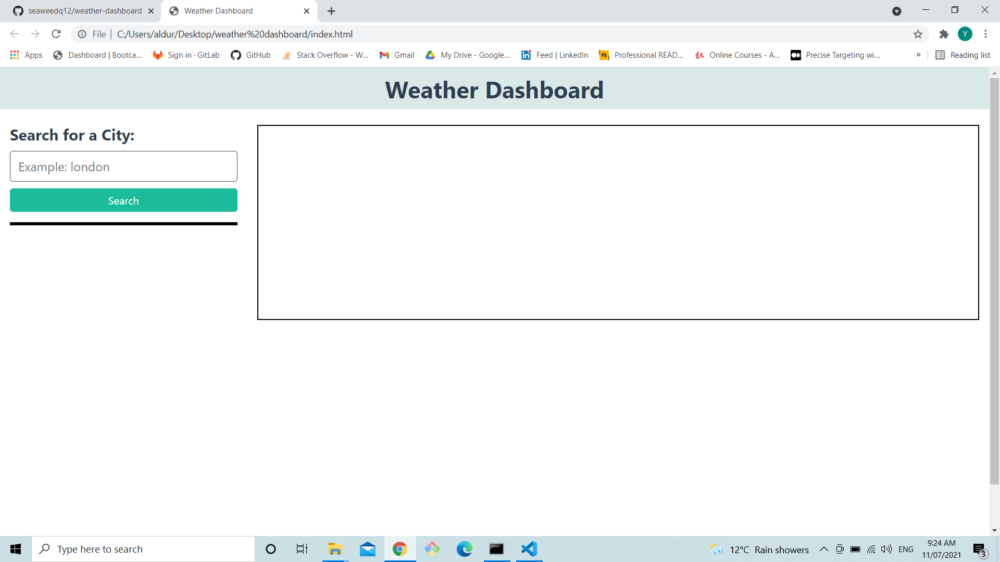
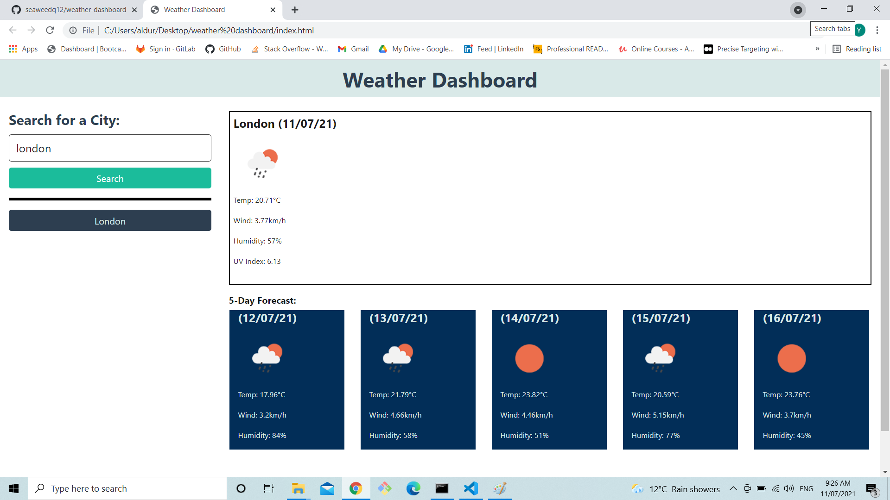
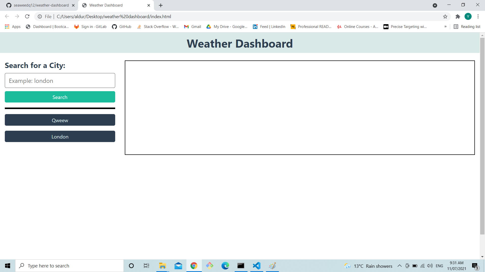

# 06 Server-Side APIs: Weather Dashboard

## Task
In this week we were given a task to build a weather bash board that let the user enter cities and view the current and future weather.
 
## URL

https://seaweedq12.github.io/weather-dashboard/

## Work

1. when the page is first loaded a small search box and a empty dashboard is shown.

2. when user enter a city and clicks search the page renders the weather of the searched city and the search is saved as a button under the search button

3. when the user enters a random input the page will show an error

4. the page is reloaded the previous searches are still on page

